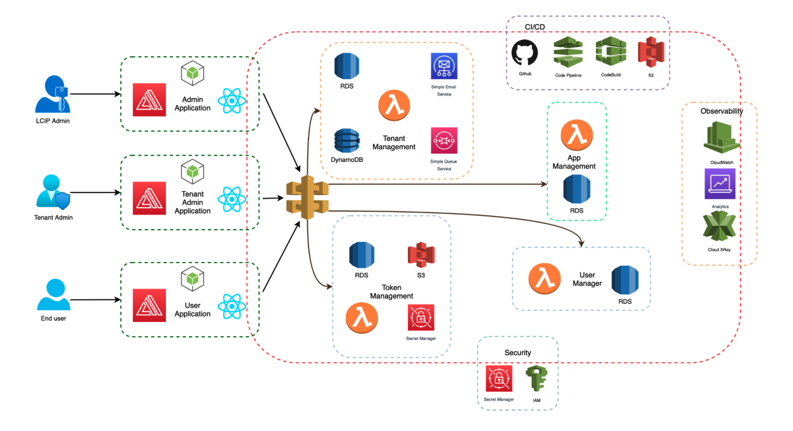
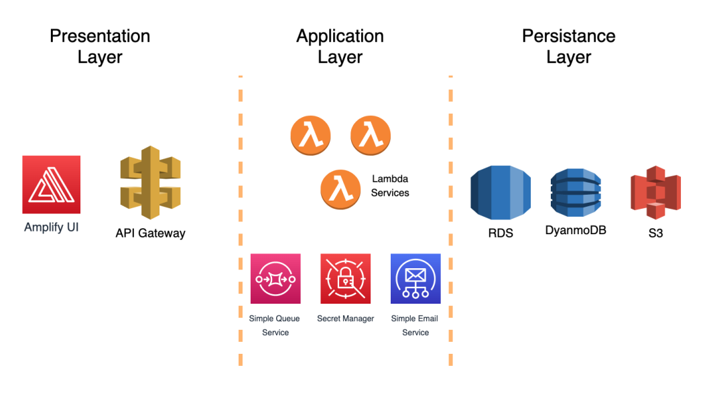
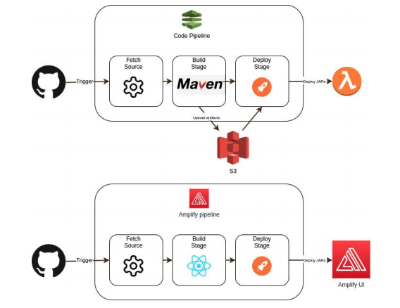
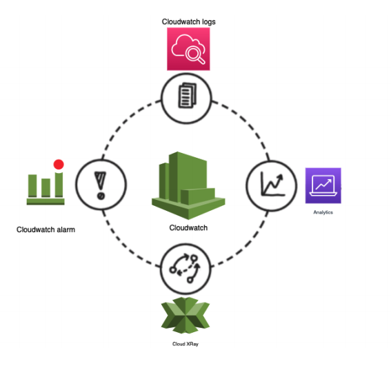

# :cloud: Light Weight Cloud Identity Provider

## :bulb: Introduction

Identity and Access Management has become an inevitable component in any application. Application developers spend 
a considerable amount of their development time to fulfill the tasks related to user authentication and authorization. 
Such tasks include: 

<ul>
    <li>User Authentication</li>
    <li>User Authorization</li>
    <li>Application Management</li>
    <li>Tenant Management</li>
</ul>

The main objective of this project is to develop an application which provides Identity and Access Management targeting 
the application developers to ease the development process. Also the solution is implemented as a cloud native 
application leveraging the existing cloud technologies mainly from Amazon.

## :classical_building: High Level Architecture

## :hammer_and_wrench: Solution Approach

Lightweight Cloud Identity Provider (LCIP) is developed using a 3-Tier architecture. The solution
consists of 3 main layers:
1. Presentation Layer
2. Application Layer
3. Persistence Layer

Following are the main components in the application layer which serves the core functionalities.

1. User Management
2. Token Management
3. Application Management
4. Tenant Management

These components are developed as microservices in Java and using the maven framework. These micro services are deployed 
in AWS Lambda and fronted via the AWS API Gateway. The user presentation is done via the react application which in 
turn calls the APIs in the gateway. The data related to user, tenant and application are persisted in Amazon RDS. 
The token is signed with private certificates where the user can validate the token from signature with a public 
certificate. The keys of these certificates are stored in AWS Secret Manager and retrieved in the runtime.

## :bricks: Components

### Lambdas

All the backed functionalities were written using <b>Amazon Lambda</b> functions. The whole project, involves several 
Lambdas to process various functionalities. These Lambdas were written in JAVA.

### :desktop_computer: User Interfaces

| Interface | Description | Link | 
| --- | --- | --- |
| :medal_military: Admin portal | A portal for super admin to manage all the tenants and users created in the system | [lcip-admin](https://github.com/kasthuriraajan/lcip-admin)
| :medal_military: Tenant portal | A portal for tenant admin to manage the users created in the their respective organization | [lcip-web](https://github.com/kasthuriraajan/lcip-web)
| :medal_military: User portal | A client portal to validate the functionalities of the system | [lcip-playground](https://github.com/kasthuriraajan/lcip-playground)

## :gear: CICD Pipeline

We have two different CI/CD pipeline for
1. Backend deployment
2. Front end deployment

Both deployments will get triggered once we push the code to the github.
Codepipeline will do the maven build and update the S3 with the latest jars. Then lambdas will
be redeployed with the new jars. Similarity Amplify will handle the front end(portal) builds using
node and get redeployed.

## :microscope: Observability

Observability can be viewed as a superset of monitoring where monitoring is enriched
with capabilities to perform debugging and profiling through rich context, log analysis,
correlation, and tracing. Modern day observability resides on three pillars of logs, metrics, and
tracing. Modern businesses require observability systems to self-sufficiently emit their current
state(overview), generate alerts for any abnormalities detected to proactively identify failures,
and to provide information to find the root causes of a system failure.
We have added Observability capabilities for our product using below AWS services.

## 👨‍💻 Contributors

 | | | 
:---:|:---:|:---:|:---:|
[Nirothipan M](https://github.com/Nirothipan)|[Arunan S](https://github.com/arunans23)|[Inthirakumaaran T](https://github.com/inthirakumaaran)|[Kasthuriraajan R](https://github.com/kasthuriraajan)

